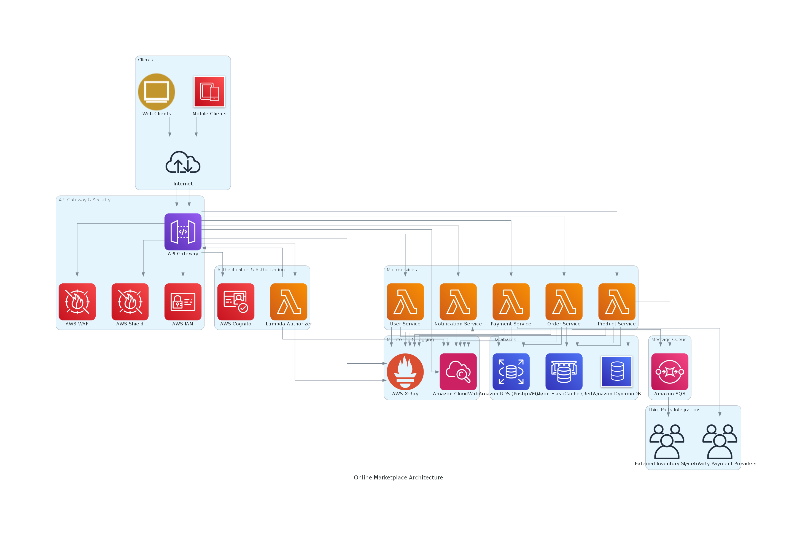

# Task 1

## Online Marketplace Architecture



## How It Works

Imagine customers shopping from their phones or browsers. Their requests hit the API Gateway, which acts like the
front door.
Before they get in, AWS WAF and AWS Shield block any troublemakers, and AWS IAM makes sure only the right
services can talk to each other.

Once inside, AWS Cognito and a Lambda Authorizer check their identity-like showing ID to get into a club.
If they pass, the API Gateway routes their requests to the right microservices:

- User Service: Handles account stuff.
- Product Service: Shows items to browse.
- Order Service: Processes orders.
- Payment Service: Deals with money.
- Notification Service: Sends emails or texts.

These are all Lambda functions - small, quick, and separate, so if one goes down, the rest keep running.

For storing data:

- Amazon RDS (PostgreSQL): Keeps user info and orders safe and structured.
- Amazon DynamoDB: Powers fast product lookups for tons of shoppers.
- Amazon ElastiCache (Redis): Caches popular items and inventory for speed.

When an order’s placed, the Order Service doesn’t wait around-it drops a message into Amazon SQS (a queue).
The Product Service updates inventory, and the Notification Service tells the customer “Order confirmed!” This
keeps things flowing even if one part slows down.

For third-party stuff:

- The Payment Service connects to Payment Providers (like Stripe or PayPal).
- The queue links to an External Inventory System to sync stock.

And to keep an eye on it all, Amazon CloudWatch and AWS X-Ray track logs and performance so we spot issues fast.

---

## Why I Chose This Setup

- Microservices with Lambda: Small, independent services beat one big app. We can scale just the busy parts (like
  orders during a sale) and fix stuff without breaking everything.
- Mix of Databases: RDS ensures consistent data for orders, DynamoDB gives speedy product reads, and Redis caches
  hot items to lighten the load.
- SQS Queue: Orders don’t wait for inventory or notifications-they queue up and process later. It’s “eventual
  consistency” for inventory, which works since small delays are fixable.
- AWS Tools: API Gateway, Cognito, and CloudWatch are managed by AWS, so we skip server headaches and get
  auto-scaling for free.
- Security: WAF, Shield, and IAM lock things down, while Cognito handles logins without us reinventing the wheel.

---

## Where It Might Struggle

- API Gateway Overload: A flash sale could swamp it. We’d use auto-scaling, rate limits, or a backup gateway for
  crazy days.
- SQS Delays: A backed-up queue might slow notifications or inventory. Add more Lambda workers or prioritize order
  messages to clear it faster.
- Database Bottlenecks: RDS could lag with tons of order writes. Sharding or read replicas would help. DynamoDB’s
  already scale-ready.
- Third-Party Hiccups: If a payment provider flakes, orders might stall. Queue and retry those requests, or switch
  to a backup provider.

---

## Summary

This architecture’s built to handle spikes (think holiday rushes), keep orders rock-solid, tie in external systems, and
stay secure with full visibility.
It’s not flawless - nothing is - but it’s a strong foundation for marketplace.

# Task 2

## Code Analysis & Improvement

```
from flask import jsonify
    def create_order(request):
    order_data = request.get_json()
    order_id = generate_unique_id()
    try:
        db.insert('orders', {'id': order_id, order_data})
    except Exception as e:
        return jsonify({"error": "Order creation has failed"})
    product_id = order_data.get('productId')
    try:
        db.execute("UPDATE products SET stock = stock - 1 WHERE id = {product_id}")
    except Exception as e:
        return jsonify({"error": "Inventory update has failed"})
    return jsonify({"orderId": order_id, "status": "created"})
```

### 1. Identify Issues

1. Concurrency:
   The inventory update query does not handle concurrent requests properly, leading to race conditions.

2. Data Consistency:
   The order creation and inventory update operations are not atomic.
   If the inventory update fails after the order is created, the system is left in an inconsistent state.

3. Security:
   Direct SQL interpolation makes the code vulnerable to SQL injection.
   Sensitive error details could be exposed to the client.

4. Error Handling:
   Generic error messages make debugging difficult and provide poor feedback to the client.
   Broad exception handling (Exception) masks specific issues.
   The database exceptions don’t trigger a rollback mechanism, meaning partial updates could persist.

5. No validation of the payload. E.g. check if the order stock is a positive number.

6. Endpoint should create proper status codes.
   E.g.
   - status 201 for created order.
   - status 4** for client error.
   - status 5** for server side errors.

7. Endpoint should probably schedule some email for the user.

8. Some logs would be beneficial.

### 2. Improvements

#### a. Refactoring for Reliability and Consistency

- Ensure both order creation and stock updates succeed or fail together.
- Before inserting an order, verify that enough stock is available.
- Return appropriate HTTP status codes and log detailed errors.

Refactored Code:

```
from flask import jsonify, request
from sqlalchemy.exc import IntegrityError
from db import get_db_session  # SQLAlchemy session manager
import logging

def create_order(request):
    session = get_db_session()
    order_data = request.get_json()
    product_id = order_data.get('productId')

    try:
        # Check stock availability first
        product = session.execute(
            "SELECT stock FROM products WHERE id = :product_id FOR UPDATE",
            {"product_id": product_id}
        ).fetchone()

        if not product or product.stock < 1:
            return jsonify({"error": "Product out of stock"}), 400

        order_id = generate_unique_id()

        # Perform both operations within a transaction
        session.execute("INSERT INTO orders (id, ...) VALUES (:order_id, ...)", 
                        {"order_id": order_id, order_data})
        session.execute("UPDATE products SET stock = stock - 1 WHERE id = :product_id", 
                        {"product_id": product_id})
        
        session.commit()
        return jsonify({"orderId": order_id, "status": "created"}), 201

    except IntegrityError:
        session.rollback()
        logging.exception("IntegrityError exception occured during order creation")
        return jsonify({"error": "Database integrity error"}), 400

    except Exception as e:
        session.rollback()
        logging.exception("Unhandled exception occured during order creation")
        return jsonify({"error": str(e)}), 500
```

#### b. Transactions vs. Compensating Strategy

Transactions (used above) ensure atomicity - either both operations succeed, or neither does.
A compensating strategy could be useful if the system integrates with an external inventory system (e.g., rollback order
creation if stock update fails).


# Task 3
## Aligning Technology with Business

1. Ensuring technical solutions align with business goals.

To ensure that technical decisions support business objectives, I always start by understanding the why behind the requirements. 
It’s not enough to just build a feature—I need to know how it contributes to revenue, user experience, or operational efficiency. 
I stay aligned by:

- Regular collaboration with stakeholders - Business teams focus on growth and market fit, while engineering focuses on stability and performance. Bridging that gap means having ongoing discussions with product managers and leadership.
- Prioritization based on impact - Instead of just optimizing code for the sake of it, I prioritize work that either increases revenue, reduces costs, or improves user retention.
- Building for adaptability - In fast-moving markets, the ability to pivot is crucial. Overengineering for an unknown future is wasteful, so I aim for modular and loosely coupled architectures that can evolve as business needs change.
A good example is choosing between on-premise and cloud solutions. While cloud offers scalability, if a business has strict regulatory constraints (e.g., in finance or healthcare), an on-premise solution may be the better long-term investment. Understanding these trade-offs is key.

2. Balancing tech debt, scalability and business needs

In a recent project, our team needed to implement a chatbot for our platform. The business had tight deadlines and required a quick MVP to enhance customer support. Instead of building an LLM from scratch, we opted to use ChatGPT as the foundation for the chatbot and added a Retrieval-Augmented Generation (RAG) layer to enable it to pull specific, real-time data from our internal databases.

Speed over Perfection: To meet the deadline, we focused on delivering a working MVP quickly, knowing that it would come with some technical debt. We used ChatGPT for general language processing but deferred more complex customization and optimization for future phases.

Scalability: For scalability, we designed the system to be modular, allowing us to easily swap or scale components (like the RAG layer) as the chatbot’s capabilities grew.

Evolving Requirements: As the product evolved, so did the requirements. Initially, the chatbot only needed basic functionality, but over time, it had to handle more complex tasks like doing some actions on behalf of the user. We ensured our architecture was flexible enough to accommodate these growing needs without a complete overhaul.

This approach allowed us to deliver value quickly while leaving room for future improvements, balancing speed, technical debt, and scalability effectively.


3. My approach anf trade-offs
Approach:
Our approach was to build the chatbot as a minimal viable product (MVP) to meet tight deadlines and quickly provide value to users.
We started by leveraging ChatGPT as the foundation due to its proven capabilities, and then added a Retrieval-Augmented Generation (RAG) layer for fetching domain-specific data from internal systems. The idea was to balance speed with functionality and build upon the core foundation as requirements evolved.

Trade-offs:

Speed vs Perfection: The MVP required a quick rollout, which meant we couldn’t fine-tune the system to its full potential in the beginning. We accepted technical debt in exchange for delivering something useful within the business’s short timeframe.

Short-Term Solution vs. Long-Term Scalability: While the initial system was not fully optimized for scale, we knew the architecture could be expanded to handle more complex queries and integration with other systems in the future.

Customization vs time-to-market: By using ChatGPT, we avoided the lengthy process of developing a custom LLM. However, this limited our ability to fully control the chatbot’s responses and required us to focus on workarounds for more specific user needs.

Outcome:

We successfully launched the MVP on time, which was well-received by users for its ability to handle basic queries and reduce the load on customer support. As the business needs grew, we iterated on the system, improving its functionality and customization. The initial trade-offs allowed us to quickly deliver value while leaving room for future enhancements without overcomplicating the early stages.